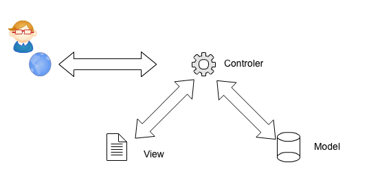

=============================
Rails事始め
=============================

Ruby On Railsとは
----------------------------

「Ruby On Rails」とは、プログラミング言語Rubyを使って作られたWebアプリケーションを作成するための **フレームワーク** です。

極論を言えば、Webアプリケーションとは「ユーザのリクエストからHTMLを生成し、ユーザーに送信するプログラム」ということになります。従って、本来は非常にシンプルな文字列処理のプログラムです。

ただ、素っ気ない文字だけではなく、レイアウトや画像、またユーザーの入力した情報を元にHTMLを生成することなどから発生するデータベース処理などがあるため、アプリケーションとして複雑になって行きます。

また、HTMLはブラウザにて表示される為、サーバー側で想定しているのと同じように表示されているかについては確かめようがありません。

Ruby On Railsはこのような難しいWebアプリケーション開発を楽にしたり、セキュリティに関するケアレスミスを防ぐなどの役割を担います。

Ruby On Railsの特徴
----------------------------

Ruby On Railsはこれらの役割を担う為、大量のライブラリから構成されています。
開発者はこのライブラリを駆使し、足りない部分を自分で作成し、ライブラリをコアとしたソフトウェアを構築することになります。

Ruby on Railsは他のフレームワークに比べルールが厳密です。
例えば、ファイルを置く位置はすべて決められており、ファイル名についても規則があります。Railsはこの「ルール」に開発者が従うことを条件としますが、逆にいうとルールに従う場合最大限のサポートを約束してくれます。

ＭＶＣ
--------------------------

RubyOnRailsによるアプリケーションの構成
------------------------------------------

**重要なフォルダ**

app : 生成されたソース、自作のソースを置く場所

config : 設定ファイル

public : 画像、Javascriptのファイルを置く場所

**表示されるまでの流れ**

#. ユーザーからリクエストが来る
#. サーバがリクエストを受け付けて、ルールに従いソースを呼び出す(config/route.rb)
#. 結果の画面（つまりHTML）を作る
   (app/controllers/
#. ユーザーへ送る

**ルール**

例：http:// アドレス / books / 1

app/controller/books_controller.rbが呼ばれます。
あとはリクエストの内容にしたがって

  * 一覧表示：index
  * 詳細表示：show
  * 編集画面：edit
  * 新規作成：new

が呼び出されます。

結果の出力は
app/view/コントローラー名/上記の名前(indexやnew）
が担当します。

