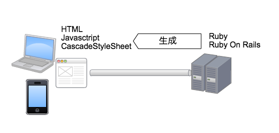

====================================
Webアプリケーション開発
====================================

Webアプリケーション開発を身に付けるロードマップ
==================================================

最低限必要なステップは

#. プログラミング言語の基礎を学ぶ
#. HTML,Javascript,CSSの役割とそれ自体を学ぶ
#. Web開発用のフレームワークを学ぶ

さらに

#. HTTPに関する知識
#. Linuxに関する知識

についても学ぶ必要があります。

Webアプリケーションとは
====================================

Webサーバはリクエストを受け、HTMLファイルや関連するスタイルシート、Javascriptなどをリクエスト元に配信する。この場合、リクエストを受け付ける事前にファイルが作成されて配置されているならば「静的」なコンテンツ配信と言うことが出切る。つまり、リクエスト時にWebサーバが行う事は、リクエストに従ってファイルを探し、その内容をそのまま伝えることになる。

Webアプリケーションと言われる一連のプログラムは、この「コンテンツ」をリクエストが行われた瞬間にプログラムを実行して作成し、サーバ上にファイルとして存在しないHTMLをリクエスト元へ配信する仕組みを指す。

Webアプリケーションが生成するものは、あくまでHTMLやCSSやJavascriptといった文字情報である。
